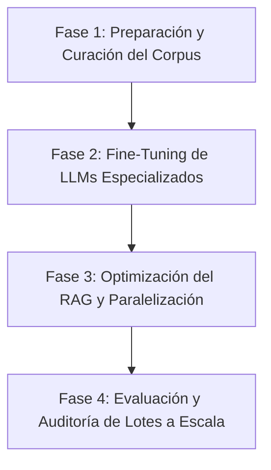

# Propuesta de Proyecto: Convocatoria Laboratorio de Supercómputo CIMAT 2026

## Título del Proyecto
**Escalamiento y Paralelización de Modelos de Lenguaje y RAG para Clasificación Arancelaria Masiva en Comercio Exterior**

---

## Información Básica de la Solicitud

| Campo | Detalle |
| :--- | :--- |
| **Nombre del Solicitante** | Ing. Sergio Adrián Pérez Villarreal |
| **Institución del Solicitante** | VUCEM Optimizer S.A. de C.V. |
| **Duración del proyecto en meses** | 4 meses (con opción a extensión de 5 meses conforme a lineamientos) |
| **Requerimiento en horas de CPU** | 10,000 horas de CPU |
| **Requerimiento en horas de GPU** | 2,000 horas de GPU (compatibles con CUDA) |
| **Requerimientos de almacenamiento** | 250 GB |
| **¿Desea iniciar una nueva colaboración con un experto de CIMAT?** | Sí (Se detalla en la Sección 8) |
| **¿El solicitante tiene experiencia previa en supercómputo?** | Sí (Desarrollo y despliegue de modelos de deep learning en clusters locales y cloud) |
| **Tipo de proyecto** | Proyecto Tipo I y Tipo II |

---

### Nota sobre el Tipo de Proyecto:
Este proyecto califica bajo ambas modalidades:
*   **Tipo I:** Debido a la necesidad de múltiples evaluaciones de funciones y pasadas de entrenamiento en el ajuste fino (Fine-Tuning) de modelos de lenguaje natural de gran escala (LLMs) y la optimización de hiperparámetros del sistema RAG.
*   **Tipo II:** Debido a la implementación de algoritmos de procesamiento paralelo (multi-hilo y multi-nodo) para el cálculo semántico y la vectorización de bases de datos masivas (LIGIE, NICO, e históricos de pedimentos) utilizando paralelización CUDA en GPU y OpenMP/MPI en CPU.

---

## 1. Introducción
La clasificación arancelaria es el proceso jurídico-técnico mediante el cual se asigna un código numérico (fracción arancelaria) a las mercancías que entran o salen de un país, de acuerdo con el Sistema Armonizado (SA) y, en el caso de México, la Ley de los Impuestos Generales de Importación y de Exportación (LIGIE). Una clasificación correcta es crítica: determina el pago de aranceles (IGI/IGE), el cumplimiento de Regulaciones y Restricciones No Arancelarias (RRNAs, como permisos de COFEPRIS, SENASICA o SEMARNAT) y evita sanciones severas aplicadas por el SAT, tales como el inicio de un PAMA (Procedimiento Administrativo en Materia Aduanera), multas equivalentes al 130% del valor de la mercancía, o la pérdida de la patente aduanera.

Con la entrada en vigor de los Números de Identificación Comercial (NICO), el catálogo arancelario en México se ha vuelto altamente complejo, sumando más de 8,000 códigos específicos que se actualizan frecuentemente de acuerdo con fuentes oficiales como el Servicio Nacional de Información de Comercio Exterior (SNICE) y la Ventanilla Única de Comercio Exterior Mexicana (VUCEM).

Actualmente, las empresas importadoras y agencias aduanales procesan diariamente miles de SKUs con descripciones textuales comerciales heterogéneas, ambiguas y a menudo redactadas con tecnicismos propios del fabricante. Clasificar estas descripciones de manera manual es ineficiente, costoso y propenso a errores. Para mitigar esto, hemos desarrollado un **Clasificador AI** local basado en recuperación semántica (RAG) y LLMs (como *Gemini 1.5 Flash* y modelos open-source locales). Sin embargo, procesar millones de registros históricos de pedimentos, indexar de forma continua las regulaciones legales en tiendas vectoriales densas, y entrenar localmente modelos de lenguaje (LLMs de 8B a 70B parámetros) adaptados a la jerga aduanera mexicana exige una capacidad de cómputo que sobrepasa los servidores convencionales. 

Este proyecto propone utilizar la infraestructura de supercómputo del CIMAT para entrenar, paralelizar y evaluar a gran escala un clasificador inteligente híbrido (lexical-semántico y generativo), garantizando la soberanía de los modelos, la privacidad de los datos de comercio exterior y reduciendo drásticamente los tiempos de procesamiento.

---

## 2. Objetivos

### Objetivo General
Escalar y optimizar el motor de clasificación arancelaria e indexación jurídica "VUCEM Optimizer AI Engine" a través de la paralelización de búsquedas vectoriales (RAG) y el ajuste fino (Fine-Tuning) de modelos de lenguaje natural (LLMs) de código abierto en la infraestructura del Laboratorio de Supercómputo del CIMAT.

### Objetivos Específicos
1.  **Fine-Tuning de LLMs Locales:** Ajustar modelos de lenguaje abiertos (como *Llama-3-8B-Instruct* y *RoBERTa-large* en español) con un corpus especializado en derecho aduanero mexicano, nomenclatura arancelaria de la LIGIE y notas explicativas del Sistema Armonizado.
2.  **Optimización del Motor RAG Híbrido:** Estructurar e indexar una base de datos vectorial unificada (ChromaDB/Milvus) con las regulaciones de SNICE y VUCEM, optimizando la generación de embeddings en GPU para consultas en tiempo real (<50ms).
3.  **Paralelización de Búsqueda Vectorial:** Implementar algoritmos basados en CUDA y OpenMP para distribuir en múltiples hilos y nodos la búsqueda semántica e interpretación de Reglas Generales de Interpretación (RGI).
4.  **Auditoría y Evaluación Masiva:** Procesar en paralelo bases de datos de auditoría histórica que contienen más de 100,000 artículos para evaluar la precisión del clasificador frente a las clasificaciones emitidas originalmente por agentes aduanales, reduciendo el tiempo de ejecución de días a minutos.

---

## 3. Metodología
El proyecto se estructurará en cuatro fases metodológicas clave:

### Fase 1: Preparación y Curación del Corpus de Comercio Exterior
Se recopilarán y estructurarán los datos oficiales de las siguientes fuentes:
*   Tarifa de la Ley de los Impuestos Generales de Importación y de Exportación (TIGIE) con sus más de 8,000 NICO vigentes.
*   Notas explicativas oficiales de la Organización Mundial de Aduanas (OMA).
*   Criterios de clasificación emitidos por el SAT y publicados en el Diario Oficial de la Federación (DOF).
*   Base de datos histórica de descripciones comerciales de aduanas anonimizadas (más de 1,000,000 de registros).
Se realizará un proceso de limpieza, normalización de caracteres, tokenización y estructuración en formato JSON.

### Fase 2: Fine-Tuning de LLMs Especializados (LIGIE-LLM)
Para evitar la dependencia de APIs comerciales (OpenAI/Google) y salvaguardar el secreto fiscal/industrial, se entrenará un LLM de uso local:
*   **Modelo Base:** *Llama-3-8B-Instruct* y *DeepSeek-R1-Distill-Llama-8B*.
*   **Técnicas de Entrenamiento:** Ajuste de bajo rango adaptativo (QLoRA) para reducir los requisitos de memoria gráfica sin comprometer la precisión.
*   **Optimización de Gradientes:** Uso de la biblioteca *DeepSpeed* para partición de estados del optimizador (ZeRO stage 3) y paralelismo de datos entre múltiples GPUs del CIMAT.
*   **Hardware:** Uso de tarjetas NVIDIA de alto rendimiento con CUDA.

### Fase 3: Optimización de la Arquitectura RAG (Retrieval-Augmented Generation)
El sistema actual utiliza embeddings de tipo `all-MiniLM-L6-v2`. Se migrará a un modelo en español de mayor dimensionalidad (como `intfloat/multilingual-e5-large-instruct`), el cual requiere mayor capacidad de cómputo para la vectorización de los textos legales.
*   Se generarán y almacenarán los embeddings en una base vectorial distribuida.
*   Se paralelizará el motor de búsqueda híbrido (BM25 léxico + embeddings semánticos) mediante el uso de hilos concurrentes en CPU (OpenMP) para combinar las puntuaciones de relevancia de forma veloz.

### Fase 4: Programación en Paralelo y Evaluación Masiva (MPI/CUDA)
Para el procesamiento en lotes de catálogos de inventarios masivos (>100,000 SKUs de clientes corporativos), se implementará un pipeline distribuido:
*   Los SKUs se particionarán y distribuirán entre los nodos de cómputo del cluster usando MPI.
*   Cada nodo utilizará recursos de CPU acelerados para evaluar las Reglas Generales de Interpretación (RGI 1 a 6) de manera heurística.
*   Se generará un reporte de auditoría completo en PDF y Excel detallando las discrepancias encontradas, el nivel de confianza y el mapa de razonamiento merciológico.

---

## 4. Relación con Problemas Nacionales o Impacto Esperado del Proyecto
El comercio internacional representa más del 70% del PIB de México. La eficiencia en las aduanas y la correcta declaración arancelaria influyen directamente en la economía nacional y en la recaudación fiscal:
*   **Mitigación de Evasión Fiscal e Infracciones:** Al automatizar y verificar con precisión la clasificación de mercancías complejas (como químicos, dispositivos médicos, maquinaria y electrónica), se evita la clasificación errónea maliciosa o accidental que reduce la recaudación del Impuesto General de Importación.
*   **Facilitación del Comercio y Competitividad:** Reducir el tiempo de clasificación de mercancías críticas agiliza las cadenas de suministro de industrias automotriz, aeroespacial y médica radicadas en México (y específicamente en la región del Bajío/Guanajuato).
*   **Soberanía Tecnológica:** La creación de modelos lingüísticos adiestrados en derecho fiscal/aduanero de México de acceso local asegura que las empresas mexicanas y el sector público puedan automatizar procesos regulados sin exportar datos sensibles e industriales a servidores en el extranjero.
*   **Impacto Regional (Guanajuato):** Al colaborar directamente con el CIMAT, se fomenta la vinculación de alta tecnología en inteligencia artificial dentro del ecosistema de innovación del estado de Guanajuato, alineado con las metas de SECIHTI e IDEA GTO.

---

## 5. Resultados Esperados
Al término del proyecto (4 meses), se habrán alcanzado los siguientes entregables y resultados:
1.  **LIGIE-LLM (Modelo Ajustado):** Un modelo de lenguaje de 8 mil millones de parámetros afinado específicamente para la nomenclatura y terminología arancelaria de México, listo para su ejecución local.
2.  **Motor RAG Paralelizado:** Una infraestructura de recuperación semántica que reduzca los tiempos de búsqueda arancelaria sobre millones de registros a menos de 50ms por consulta.
3.  **Pipeline de Auditoría por Lotes:** Script de procesamiento paralelo basado en MPI/CUDA capaz de auditar catálogos masivos (>100,000 SKUs) en menos de 10 minutos.
4.  **Artículo de Memorias (CIMAT):** Redacción y entrega del reporte técnico del proyecto, detallando la arquitectura del clasificador y los resultados de aceleración computacional, para su publicación en el Libro de Memorias oficial de la convocatoria.

---

## 6. Justificación de la Necesidad de Usar Recursos de Supercómputo
El uso de hardware de supercómputo es indispensable por las siguientes razones de ingeniería:
*   **Entrenamiento de Redes Neuronales Profundas (LLMs):** El ajuste fino de modelos basados en arquitectura Transformer como *Llama-3-8B* requiere la carga de pesos en alta precisión (16 bits), la memoria del optimizador y los gradientes del corpus legal. Esto representa una necesidad de VRAM superior a 48 GB por tanda, imposible de ejecutar en estaciones de trabajo estándar. Se requiere el uso de clusters de GPU (mínimo tarjetas NVIDIA A100 o H100) interconectadas.
*   **Vectorización Masiva en Paralelo:** Generar embeddings de millones de fragmentos normativos utilizando modelos multilingües avanzados (`e5-large`) requiere procesamiento por lotes acelerado mediante CUDA. El uso de CPUs comerciales retrasaría semanas el procesamiento que un cluster de GPUs puede resolver en horas.
*   **Simulación y Evaluación de Desempeño a Gran Escala:** La simulación de auditoría sobre catálogos de cientos de miles de SKUs de clientes reales requiere arquitecturas multinucleo (CPU masiva) para distribuir la carga léxica, normalización lingüística y el parseo heurístico de las RGI sin colapsar la memoria RAM.

### Desglose Estimado de Recursos Computacionales

| Recurso | Demanda Estimada | Justificación Técnica |
| :--- | :--- | :--- |
| **Horas CPU** | 10,000 horas | Indexación de texto, procesamiento léxico (BM25), normalización y control del pipeline MPI. |
| **Horas GPU** | 2,000 horas | Fine-Tuning del LLM (QLoRA/DeepSpeed) y cálculo masivo de embeddings vectoriales. |
| **Almacenamiento** | 250 GB | Pesos de los modelos base y ajustados, bases de datos vectoriales ChromaDB/Milvus, y corpus del SAT/LIGIE. |

---

## 7. Grupo de Trabajo

El grupo de trabajo está compuesto por los siguientes profesionales de la ingeniería de software y ciencias computacionales:

*   **Ing. Sergio Adrián Pérez Villarreal**
    *   *Rol en el proyecto:* Solicitante Principal, Arquitecto de IA y Líder Técnico.
    *   *Responsabilidad:* Coordinación del proyecto, diseño de la arquitectura del Clasificador AI, desarrollo del motor RAG e integración del pipeline distribuido.
    *   *Institución:* VUCEM Optimizer S.A. de C.V.
    *   *Contacto:* sergio@vucemoptimizer.com
*   **Lic. Yolanda Pérez Villarreal**
    *   *Rol en el proyecto:* Investigadora de Datos y Analista Normativa de la LIGIE.
    *   *Responsabilidad:* Curación del corpus legal, estructuración de las Reglas Generales de Interpretación (RGI), validación de la lógica de negocio aduanera e interpretación merciológica.
    *   *Institución:* VUCEM Optimizer S.A. de C.V.
    *   *Contacto:* yolanda@vucemoptimizer.com
*   **Lic. Lorena Morales Villarreal**
    *   *Rol en el proyecto:* Ingeniera de Machine Learning y Ops (MLOps).
    *   *Responsabilidad:* Configuración del entorno en el cluster de supercómputo, optimización del entrenamiento (DeepSpeed/QLoRA), paralelización CUDA y monitoreo del rendimiento de GPUs.
    *   *Institución:* VUCEM Optimizer S.A. de C.V.
    *   *Contacto:* lorena@vucemoptimizer.com

---

## 8. Tipo de Colaboración Esperada
Debido a que el solicitante es del **Sector Privado (VUCEM Optimizer)**, es requisito indispensable contar con la participación de un técnico o investigador del CIMAT. 
Solicitamos formalmente que el Comité de Supercómputo identifique y asigne un experto en:
*   **Procesamiento de Lenguaje Natural (NLP):** Para asesorar en la optimización de los hiperparámetros de fine-tuning y el alineamiento mercológico del modelo *LIGIE-LLM*.
*   **Cómputo de Alto Rendimiento (HPC):** Para apoyar en la optimización de la paralelización del motor RAG usando MPI/OpenMP sobre la arquitectura específica del cluster de CIMAT.
*   *Colaboración en el Entregable:* El colaborador del CIMAT participará activamente como coautor en la redacción científica del documento técnico que se publicará en el libro de memorias de la institución al finalizar el año.

---

## 9. Financiación que Apoya este Proyecto
Este desarrollo cuenta con el respaldo financiero y comercial de **VUCEM Optimizer S.A. de C.V.** mediante:
*   Financiamiento de salarios para el grupo de trabajo interno.
*   Infraestructura local y cloud complementaria para pruebas de pre-entrenamiento.
*   Patrocinio de licencias de bases de datos de comercio exterior.
*   Compromiso de desplegar comercialmente los resultados obtenidos para beneficio de las empresas exportadoras mexicanas.

---

## 10. Bibliografía
1.  Vaswani, A., et al. (2017). *Attention Is All You Need*. Advances in Neural Information Processing Systems (NeurIPS).
2.  Lewis, P., et al. (2020). *Retrieval-Augmented Generation for Knowledge-Intensive NLP Tasks*. Advances in Neural Information Processing Systems (NeurIPS).
3.  Hu, E. J., et al. (2021). *LoRA: Low-Rank Adaptation of Large Language Models*. arXiv preprint arXiv:2106.09685.
4.  Secretaría de Economía (2022). *Ley de los Impuestos Generales de Importación y de Exportación (LIGIE)*. Diario Oficial de la Federación (DOF).
5.  Dettmers, T., et al. (2023). *QLoRA: Efficient Finetuning of Quantized LLMs*. arXiv preprint arXiv:2305.14314.
6.  Rajbhandari, S., et al. (2020). *ZeRO: Memory Optimizations Toward Training Trillion Parameter Models*. IEEE/ACM International Symposium on Architecture.
